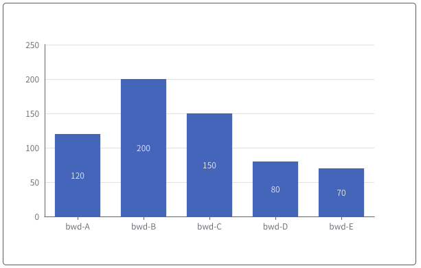
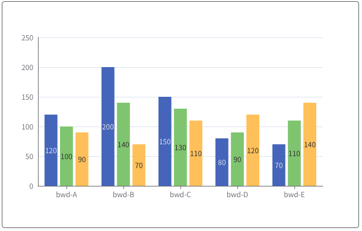
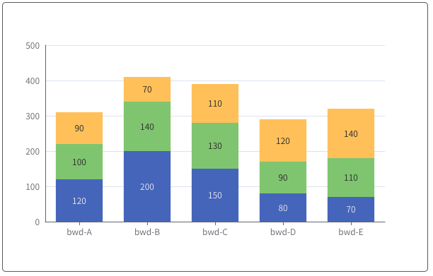
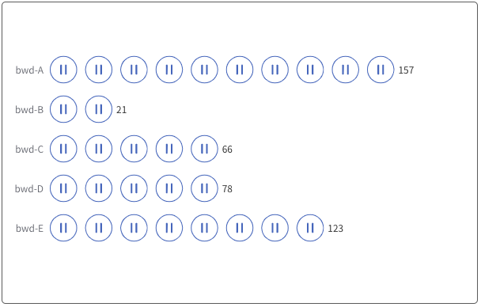

# 柱状图系列

### 说明：

```javascript
import { bwdBar } from "bwd-components";

components: {
  bwdBar;
}
```

#####

```html
 <bwd-bar :barOption="barOption" ref="bwdBar"></bwd-bar>
```

```javascript

    this.$refs.bwdBar.drawEcharts() // 执行绘制

    data(){
        return {
            barOption: {
                type: 'base', // base:基础柱状图  group:分组  stack：堆叠  symbol:符号

                //base数据格式
                data: {
                    xData: ['bwd-A', 'bwd-B', 'bwd-C', 'bwd-D', 'bwd-E'],
                    yData:[
                        [120, 200, 150, 80, 70],
                    ]
                },

                //group数据格式
                data: {
                    xData: ['bwd-A', 'bwd-B', 'bwd-C', 'bwd-D', 'bwd-E'],
                    yData:[
                        [120, 200, 150, 80, 70],
                        [100, 140, 130, 90, 110],
                        [90, 70, 110, 120, 140],
                    ]
                },

                //stack数据格式
                data: {
                    xData: ['bwd-A', 'bwd-B', 'bwd-C', 'bwd-D', 'bwd-E'],
                    yData:[
                        [120, 200, 150, 80, 70],
                        [100, 140, 130, 90, 110],
                        [90, 70, 110, 120, 140],
                    ]
                },

                //symbol数据格式
                data: {
                    yData: ['bwd-A', 'bwd-B', 'bwd-C', 'bwd-D', 'bwd-E'],
                    xData:[
                        {
                            value:157,
                            symbol:'图片路径',  //具体参考echarts使用
                        },
                        {
                            value:157,
                            symbol:'图片路径',  //具体参考echarts使用
                        }
                        ...
                    ]
                },

      },
        }
    }
```

### 基础柱状图



### 分组柱状图



### 堆叠柱状图



### 符号柱状图


