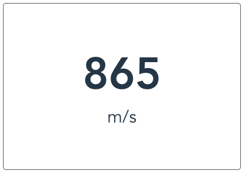
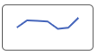

# bwd-card

### 说明：
```javascript
import {bwdCard} from 'bwd-components';

components: {
                bwdCard
            }
```


#####

### 1.统计看板-数据描述 示例图



```html
<bwd-card :cardOption="cardOption"></bwd-card>
```

```javascript
    data(){
        return {
            cardOption:{
                content:'865', //内容
                description:'m/s', //描述
            }
        }
    }
```

### 2.图表看板-mini 卡片 示例图




```html
<bwd-card :cardOption="cardOption"></bwd-card>
```

```javascript
    data(){
        return {
            cardOption:{
                 miniCard:{
                    type:'bar',  //展示的模式 line:折线图 bar:柱状图
                        data:{
                            xData:['Mon', 'Tue', 'Wed', 'Thu', 'Fri', 'Sat', 'Sun'],
                            yData:[150, 230, 224, 218, 135, 147, 260]
                        }
                    }
            }
        }
    }
```
