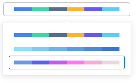

# 下拉颜色选择器

### 说明：
```javascript
import {bwdColorSelect} from 'bwd-components';

components: {
                bwdColorSelect
            }
```


#####

### 示例图



```html
<bwd-colorSelect :colorList="colorList" v-model="color"></bwd-colorSelect>
```

```javascript
    data(){
        return {
            colorList:[  //下拉颜色值数组
                ['#333','#666','#999'],
                ['red','blue','yellow']
            ],
            color:['red','blue','yellow'] // 绑定颜色值
        }
    },
    watch:{
        color(newVal,oldVal){
            //切换颜色值的变化回调操作
            //eg:可进行饼图的颜色切换
        }
    }
```


