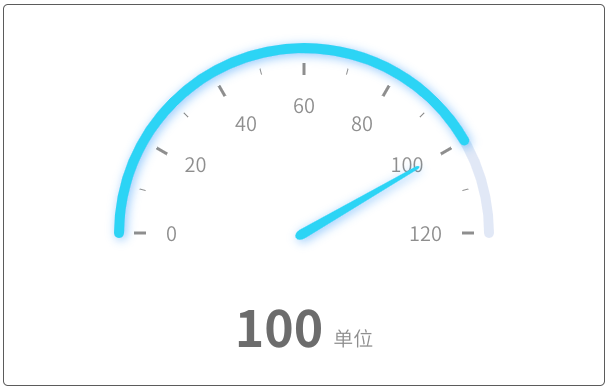

# 仪表盘系列

### 说明：

```javascript
import { bwdGauge } from "bwd-components";

components: {
  bwdGauge;
}
```

#####

```html
<bwd-gauge :gaugeOption="gaugeOption" ref="bwdGauge"></bwd-gauge>
```

```javascript

    this.$refs.bwdGauge.drawEcharts() // 执行绘制


    data(){
        return {
           gaugeOption: {
            type: 'base',
            maxNum: 120, // 仪表盘的最大值限制
            unit:'单位', // 单位说明
            data: [
            {   
                value: 100 //当前数值
            },
            ]
        },
        }
    }
```

### 基础散点图


