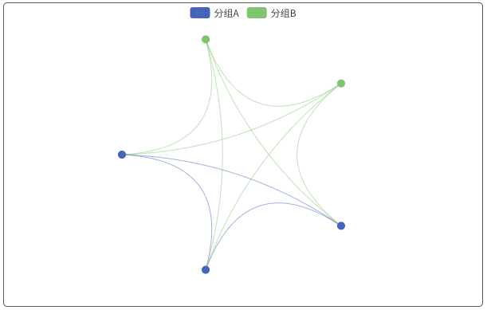

# 关系图系列

### 说明：

```javascript
import { bwdGraph } from "bwd-components";

components: {
  bwdGraph;
}
```

#####


```html
<bwd-graph :graphOption="graphOption" ref="bwdGraph"></bwd-graph>
```

```javascript

    this.$refs.bwdGraph.drawEcharts() // 执行绘制


    data(){
        return {
            graphOption: {
                type: 'base',
                data: {
                categories: [
                    { name: '分组A' },
                    { name: '分组B' }
                ],
                nodes: [
                    { category: 0, id: '0', name: '1-1' },  // category：0 0 表示categories中的索引匹配进行分组  id：唯一标识（必须）  name:名称
                    { category: 0, id: '1', name: '1-2' },
                    { category: 0, id: '2', name: '1-3' },
                    { category: 1, id: '3', name: '1-4' },
                    { category: 1, id: '4', name: '1-5' }
                ],
                links: [
                    { source: "1", target: "0" },   // 与id进行匹配，source：起点目标  target：终点目标
                    { source: "1", target: "2" },
                    { source: "2", target: "0" },
                    { source: "3", target: "0" },
                    { source: "3", target: "1" },
                    { source: "3", target: "2" },
                    { source: "4", target: "3" },
                    { source: "4", target: "1" },
                    { source: "4", target: "2" },
                    { source: "4", target: "0" },
                ]
                }
            },
        }
    }
```


### 基础关系图



