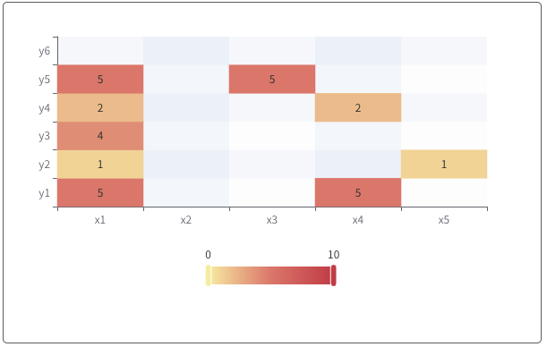

# 热力图系列

### 说明：

```javascript
import { bwdHeatmap } from "bwd-components";

components: {
  bwdHeatmap;
}
```

#####

```html
<bwd-heatmap :heatmapOption="heatmapOption" ref="bwdHeatmap"></bwd-heatmap>
```

```javascript

    this.$refs.bwdHeatmap.drawEcharts() // 执行绘制


    data(){
        return {
           heatmapOption: {
                type: 'base',
                data: {
                xAxisData: ['x1', 'x2', 'x3', 'x4', 'x5'],  // x方向数值
                yAxisData: ['y1', 'y2', 'y3', 'y4', 'y5', 'y6',], //y方向数值
                data: [
                    [0, 0, 5],  // [ x的位置索引，y的位置索引，热力值 ]
                    [0, 1, 1],
                    [0, 2, 4],
                    [0, 3, 2],
                    [0, 4, 5],
                    [3, 0, 5],
                    [4, 1, 1],
                    [5, 2, 4],
                    [3, 3, 2],
                    [2, 4, 5]
                ]
                }
            },
        }
    }
```

### 基础散点图


