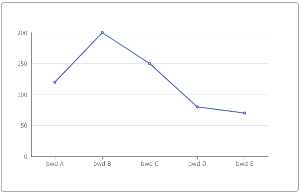
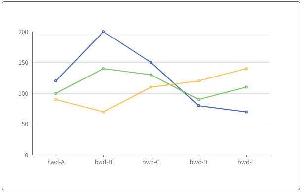
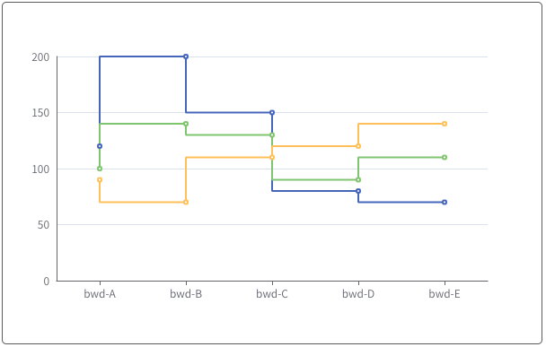
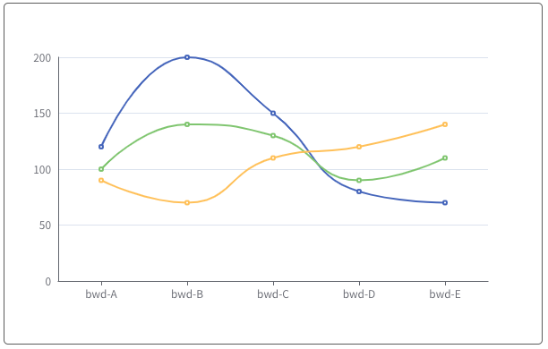

# 线性图系列

### 说明：

```javascript
import { bwdLine } from "bwd-components";

components: {
  bwdLine;
}
```

#####

```html
 <bwd-line :lineOption="lineOption" ref="bwdLine"></bwd-line>
```

```javascript

    this.$refs.bwdLine.drawEcharts() // 执行绘制

    data(){
        return {
            lineOption: {
                type: 'smooth', // base:表示单折线图  polyLine:多折线  ladder:阶梯 smooth:曲线
                colorList: [], // 颜色组选择


                //base数据格式
                xData: ['bwd-A', 'bwd-B', 'bwd-C', 'bwd-D', 'bwd-E'],
                yData: [
                    [120, 200, 150, 80, 70],
                ],

                //polyLine数据格式
                xData: ['bwd-A', 'bwd-B', 'bwd-C', 'bwd-D', 'bwd-E'],
                yData: [
                    [120, 200, 150, 80, 70],
                    [100, 140, 130, 90, 110],
                    [90, 70, 110, 120, 140],
                    ...
                ],

                //ladder,smooth 数据格式兼容base和polyLine
            },
        }
    }
```

### 单折线图



### 多折线图



### 阶梯图



### 曲线图


