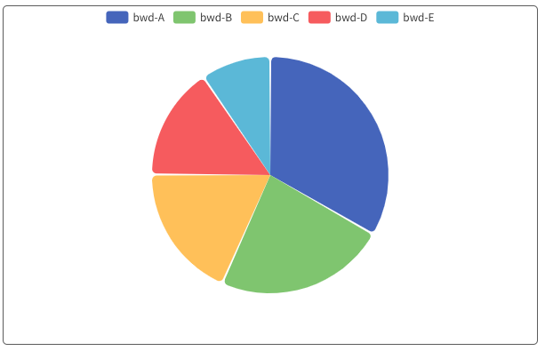
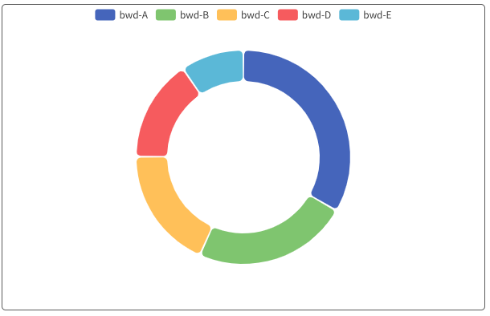
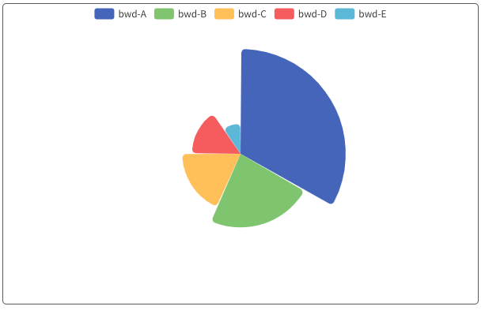
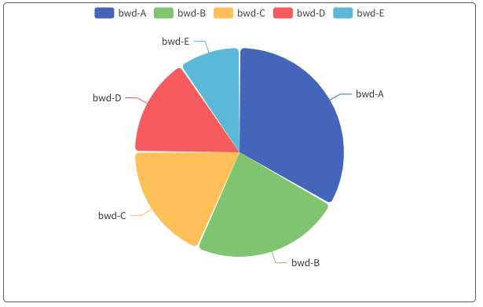

# bwd-pie

### 说明：饼图系列

```javascript
import { bwdPie } from "bwd-components";

components: {
  bwdPie;
}
```

#####


```html
<bwd-pie :pieOption="pieOption" ref="bwdPie"></bwd-pie>
```

```javascript
    data(){
        return {
            pieOption: {
                type: 'rose',  //  'base':表示基础饼图  ring：表示基础环形图 rose：表示变形饼图（玫瑰图）leadLine：表示有引导线的饼图  symbol：符号饼图  参照下方示例图
                labelShow:false, //是否显示引导线 false或者不定义则不展示引导线
                colorList: [], // 颜色组选择
                data: [
                    { value: 1048, name: 'bwd-A' },
                    { value: 735, name: 'bwd-B' },
                    { value: 580, name: 'bwd-C' },
                    { value: 484, name: 'bwd-D' },
                    { value: 300, name: 'bwd-E' }
                ]
      },
        }
    }
```


### 基础饼图


### 基础环形图


### 变形饼图（玫瑰图）


### 引导线饼图


