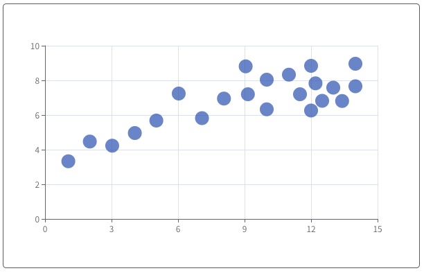

# 散点图系列

### 说明：

```javascript
import { bwdScatter } from "bwd-components";

components: {
  bwdScatter;
}
```

#####

```html
<bwd-scatter :scatterOption="scatterOption" ref="bwdScatter"></bwd-scatter>
```

```javascript

    this.$refs.bwdScatter.drawEcharts() // 执行绘制


    data(){
        return {
           scatterOption: {
            type: '',
            colorList: [], // 颜色组选择
            data: [
                [10.0, 8.04],
                [8.07, 6.95],
                [13.0, 7.58],
                [9.05, 8.81],
                [11.0, 8.33],
                [14.0, 7.66],
                [13.4, 6.81],
                [10.0, 6.33],
                [14.0, 8.96],
                [12.5, 6.82],
                [9.15, 7.2],
                [11.5, 7.2],
                [3.03, 4.23],
                [12.2, 7.83],
                [2.02, 4.47],
                [1.05, 3.33],
                [4.05, 4.96],
                [6.03, 7.24],
                [12.0, 6.26],
                [12.0, 8.84],
                [7.08, 5.82],
                [5.02, 5.68]
            ]
        },
        }
    }
```

### 基础散点图




