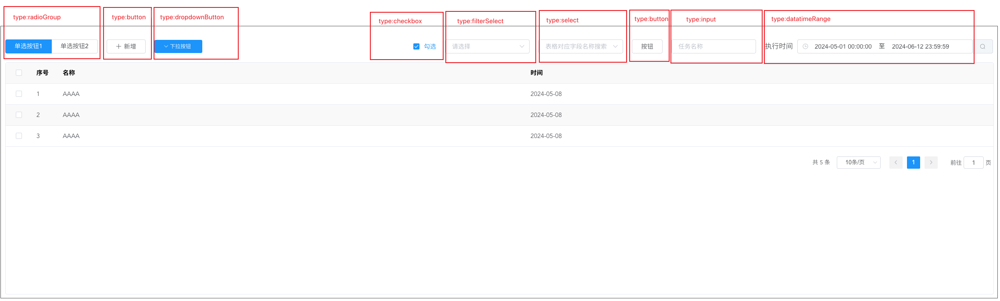

# searchTable

### 说明：配置查询的表格

##### 1.结合搜索栏（输入框，下拉选择，时间选择），操作按钮（按钮，单选按钮）列表表头过滤，列表展示，分页展示

##### 2.表格配置勾选，序号，插槽自定义

```javascript
import { bwdTable } from "bwd-components";

components: {
  bwdTable;
}
```

#####

```html
<bwd-table
  :searchForm="searchForm"
  ref="bTable"
  :config="tableconfig"
></bwd-table>
```

```javascript

    data(){
        return {
           searchForm: {
            leConditions: [
                {
                    type:'radioGroup', // 单选按钮
                    value:'radioGroup1', //当前选择按钮的绑定值
                    list:[  //渲染当前按钮的选择组成
                            {
                                value:'radioGroup1',
                                label:'radioGroup1'
                            },
                            {
                                value:'radioGroup2',
                                label:'radioGroup2'
                            }
                        ]
                },
                {
                    type:'button', // 按钮   ====>  this.$emit('btnOperate', type),需在组件上绑定
                    btnType:'primary', //   primary  success info  warning danger
                    valueName:'add', // add 表示新增  edit表示编辑
                    disabled:false, // 是否可操作
                    icon:'', // 按钮中的图标
                    label:'新增' // 按钮中文字
                },
                {
                    type: 'dropdownButton',
                    btnIcon: 'el-icon-arrow-down',
                    label: '下拉按钮',  // 按钮文字
                    dropdownMenu: [
                        {
                            value: '1', //下拉按钮绑定值
                            label: '下拉按钮1' //下拉按钮文字
                        }, {
                            value: '2', //下拉按钮绑定值
                            label: '下拉按钮2'//下拉按钮文字
                        }
                    ]
                }
            ],
            /**
             * riConditions 字段说明
             * type： 类型 是输入框，下拉框，时间选择框 勾选框 按钮
             * label：placeholder显示内容
             * value：绑定的值
             * valueName：后台查询的字段
             *
             * 下拉框说明  optionConfig：inter为下拉的接口 value：传递后台的字段 label：前端显示的字段
             * options：下拉数据
             */
            riConditions: [
                {
                    type:'checkbox', // 勾选
                    valueName:'checkbox',
                    value:'',
                    label:'勾选'
                },
                {
                    type:'filterSelect',
                    value:'',
                    label:'请选择',
                    options:[
                        {
                            value:'1',
                            label:'过滤选择1'
                        },
                        {
                            value:'2',
                            label:'过滤选择2'
                        },
                    ]
                },
                {
                    type:'button', // 按钮   ====>  this.$emit('btnOperate', type),需在组件上绑定
                    btnType:'primary', //   primary  success info  warning danger
                    valueName:'add', // add 表示新增  edit表示编辑
                    disabled:false, // 是否可操作
                    label:'新增' // 按钮中文字
                },
                {
                    type:'select',
                    value:'',
                    label:'表格对应字段名称搜索',
                    options:[]
                },
                {
                    type:'cascader', //层级选择器
                    value:'',
                    label:'表格对应字段名称搜索',
                    optionConfig: {
                        inter: '',
                        props: {
                            value: 'value',
                            label: 'label'
                        },
                        filterable: true
                    },
                    options:[]
                },
                {
                    type:'sCheckBoxGroup',
                    value:'1',
                    list:[
                    {
                        value:'1',
                        label:'label1'
                    },
                    {
                        value:'2',
                        label:'label2'
                    },
                    ]
                },
                {
                    type: 'input',
                    label: '任务名称',
                    value: "",
                    valueName: 'name'
                }
            ]
        },
            //表格配置
        tableconfig: {
            inter: getDataReportingTasklist, //列表接口获取表格数据
            //表格头部
            thead: [
            //key: 必填
            //visible: 控制列的显示与隐藏 必填
            //label: 头部标签
            //prop:绑定属性值
            //width:绑定宽度
            //align:left/center/right 对齐方式  默认左对齐
            //type:selection-->勾选框  index--> 序号
            //options:为静态数据 处理成value label对象数组
            //templateSlot  插槽处理
            // headSlot: true 表格头部插槽处理  1getOptions :为接口调用的数据请求，注意点，需要1.return promise   2.处理成value label对象数组  getOptions: { inter: getDataReportingRuleGroup, value: 'key', label: 'name' }
            //以下为举例说明
            { key: 0, visible: true, label: '勾选', prop: 'selection', width: '60', type: 'selection' },
            { key: 1, visible: true, label: '序号', prop: 'index', width: '60', type: 'index' },
            { key: 3, visible: true, label: '名称', prop: 'name' }, // 正常按照后台匹配字段展示
            { key: 4, visible: true, label: '时间', prop: 'time' },
            { key: 5, visible: true, label: '分类', prop: 'groups', headSlot: true, templateSlot: true, getOptions: { inter: getDataReportingRuleGroup, value: 'key', label: 'name' } },  //表头需要接口后去数据
            {
                key: 6, visible: true, label: '数据范围', prop: 'dataRangs', headSlot: true, templateSlot: true, options: [
                    {
                        value: 1,
                        label: '全量'
                    },
                    {
                        value: 2,
                        label: '增量'
                    },
                ],
            }, //表头数据固定写死

            ],
            //表格操作列设置
            operation: {
                isShow: false, //是否显示操作列
                label: '操作',//列名
                width: '150',
                align: ''
            },
            //功能数据
            btnList: [
                {
                    type: 'text',
                    label: '补传',
                    value: 'config',
                    disabled: ({ count }) => count == 0, //  通过字段进行权限操作，可多个进行判断
                },
            ],
            pagesizes: [10, 20, 50],

            // 不使用接口使用
            total: 5,
            tableData: [
            {
                name: 'AAAA',
                time: '2024-05-08'
            },
            {
                name: 'AAAA',
                time: '2024-05-08'
            },
            {
                name: 'AAAA',
                time: '2024-05-08'
            },
            ]
        },
        }
    },

    methods:{

        //以下需要在组件进行@绑定，名称需要一致

        //表格列操作
        handleRow(idx, row, value){

        }，

        //搜索栏的按钮操作
        btnOperate(type){

        },

        //类型为dropdownButton的绑定操作
        dropMenuHandle(value){

        },

        //打勾或取消
        handleSelect(selecteds, row){

        },

        //全选、取消全选
        handleSelectAll(selecteds) {
            
        },

        // 选中的数据
        handleSelChange(val){

        }


    }
```

### 基础散点图


